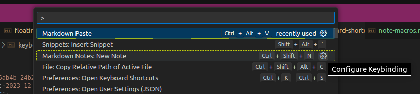

Keyboard Shortcuts (Keybindings)
======================================================================

Shortcuts are a greate way to improve your speed writing notes. 
The easiest way is to set a shortcut is from [Command Search](command-palette.md). 
You can click on the gear on the right side during the search and then you can use the GUI.  

>   

Unfortunately you cannot set shortcuts per repository. 
Therefore you have to set them yourself.  

Special Shortcuts with json
------------------------------------------------------------

To create special shortcuts you have to change your local `keybindings.json` by executing `Preferences: Open Keyboard Shortcuts (JSON)` from the command search. 

Following example opens up the insert snippet menu:  
~~~json
[
    {
        "key": "alt+u",
        "command": "editor.action.insertSnippet",
    },
~~~

By adding the `args` key, its possible to insert a specific snippet:  
~~~json
    {
        "key": "alt+m",
        "command": "editor.action.insertSnippet",
        "args": {
            "name": "NAME_OF_THE_SNIPPET"
        }
    }
]
~~~

RESOURCES
======================================================================

[code.visualstudio.com](https://code.visualstudio.com/docs/getstarted/keybindings)  
