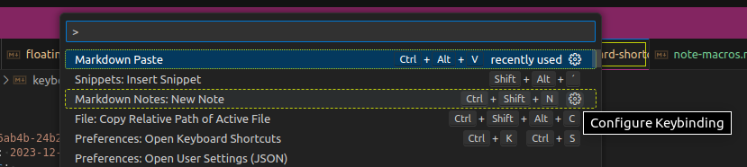

Command Search/Palette
======================================================================

Drücke in VS Code `Strg +Shift +P` um die Fuzzy-Befehlssuche zu öffnen. 
Dies ist deine Hauptschnittstelle zu allen möglichen Aufgaben. 
Mögliche Shortcuts werden dir hier auch direkt angezeigt. 

`Strg +P` öffnet die Dateisuche, sodass du nicht den Dateibrowser nutzen musst.  

>   

RESOURCES
======================================================================

[code.visualstudio.com](https://code.visualstudio.com/docs/getstarted/userinterface#_command-palette)  
[code.visualstudio.com](https://code.visualstudio.com/api/ux-guidelines/command-palette)  
