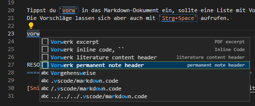

VS Code Snippets
======================================================================

Snippets sind vorgefertigte Textbausteine die einfach in Quelltexte eingefügt werden können.  

Es gibt globale, user-spezifische und lokale Snippets speziell für dieses Projekt. 
Die lokalen sind in [.vscode/markdown.code-snippets](/.vscode/markdown.code-snippets) angelegt.  

Tippst du `vorw` in das Markdown-Dokument ein, sollte eine Liste mit Vorschlägen erscheinen. 
Die Vorschläge lassen sich aber auch mit `Strg+Space` aufrufen. 

  

RESOURCES
======================================================================

[Snippets on VSCode User Guide](https://code.visualstudio.com/docs/editor/userdefinedsnippets)  
