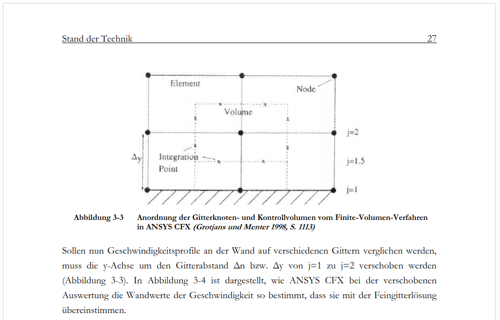

Lehmkuhl, Jan 2018 - Modellierung einer numerischen Wandfunktion für einphasige CFD-Simulationen in einem LWR-Sicherheitsbehälter
======================================================================

Modeling of a Numerical Wall Function for Single-Phase CFD-Simulations within a LWR-Containment

### corresponding files
[katalog.ub.rwth-aachen.de](https://katalog.ub.rwth-aachen.de/discovery/fulldisplay?docid=alma991008600089706448&context=L&vid=49HBZ_UBA:VU1)  

[PDF-File](Lehmkuhl2018_Dissertation_modeling-a-numeric-wall-function.pdf)  
[publications.rwth-aachen.de](https://publications.rwth-aachen.de/record/751645/files/751645.pdf)  

### content
##### My Assessment

##### My Synopsis

##### Abstract

EXCERPTS
======================================================================

<!-- here place your excerpts -->
<!-- you can devide the chapters by second & third level header -->

##### 520781
**___
CFD Analysen sollen vermehrt in Sicherheitsanalysen für KKW eingesetzt werden.  
___**  
excerpt page: i
###### my assessment
###### my synopsis
###### citation
Sicherheitsanalysen für Kernkraftwerke unterstützen die Hersteller und Regulierungsbehörden dabei, Empfehlungen für Notfallschutzmaßnahmen während eines Störfalls zu erstellen und Verbesserungspotenziale für die Nachrüstung der Anlagen aufzuzeigen. 
Für die Analyse des Ereignisverlaufs nach einem Kühlmittelverluststörfall sollen vermehrt räumlich auflösende numerische Strömungssimulationen (engl. Computational Fluid Dynamics, kurz: CFD) zur Beschreibung der Strömungsverhältnisse im Sicherheitsbehälter und der daraus resultierenden Druckbelastungen auf den Sicherheitsbehälter eingesetzt werden. 

##### 333966
**___
Für belastbare CFD-Simulationen im Sicherheitsbehälter ist Weiterentwicklung bei Wandfunktionen notwendig. 
___**  
excerpt page: 14/15
###### my assessment
Aus Literatur belegte Schlussfolgerung
###### my synopsis
- Reduzierung der Rechenzeiten nötig
- Effektiv besonders an den Wänden
- AWT von Ansys nicht ausreichend 
- Weiterentwicklung nötig
###### citation
Damit belastbare Sicherheitsanalysen mit CFD-Methoden in technisch relevanten Rechenzeiten durchgeführt werden können, müssen die aktuellen Gitteranforderungen reduziert werden, ohne dass dadurch ein Informationsverlust entsteht (Pieringer und Sanz 2005, S. 1090). 
An den Wänden werden besonders feine Gitterauflösungen benötigt, da sich Strömungen hier stark ändern, wodurch bei zu groben Gittern die Differenzen bzw. Gradienten zwischen den einzelnen Zellen für eine gute numerische Lösung zu groß werden. 
Für einphasige Gasströmungen existiert dafür das Wandfunktionskonzept, welches die sonst notwenigen wandnahen feinen Gitterzellen durch eine Modellierung überbrückt (ANSYS 2012, Kap. 2.8.1). 
Eine wesentliche Erkenntnis aus dem International Standard Problem (ISP) 47 war, dass die aktuelle Wandfunktionsimplementierung, wie sie von ANSYS mit dem Automatic Wall Treatment (AWT) angeboten wird, für eine belastbare CFD-Rechnung eines Kühlmittelverluststörfalls nicht ausreicht. 
Vielmehr sind für die anvisierten CFD-Störfallsimulationen Entwicklungen in der Wandbehandlung erforderlich, die eine ausreichende Modellierung der Grenzschicht besonders bei natürlicher Konvektion und Kondensation gewährleisten (Allelein et al. 2007, S. 75).

##### 574106
**___
Wandfunktionen reduzieren die hohen numerischen Kosten an Wänden durch eine eindimensionale Vereinfachung  
___**  
excerpt page: 37
###### my assessment
###### my synopsis
###### citation
An der Wand sind die Gradienten in der Strömung besonders ausgeprägt, sodass normalerweise eine entsprechend feine Gitterauflösung notwendig ist, die hohe numerische Kosten verursacht.
Das Ziel von Wandfunktionen ist es, die für die Strömungsgradienten an der Wand nötigen hohen Gitterauflösungen durch angepasste Randbedingungen zu vermeiden, die die Informationen für die Hauptströmung auf groben Gittern nicht verändern. 
Diese Randbedingungen werden durch Wandfunktionen erreicht, die die aufwändigen, dreidimensionalen Gitterberechnungen durch eindimensionale Lösungen modellieren. 
Diese Wandfunktionen werden dem CFD-Code meistens als algebraische Lösung der Geschwindigkeitsgrenzschicht (wie z.B. die Beziehungen in Abbildung 3-1 und Abbildung 3-5) als Randbedingung zur Verfügung gestellt.

##### 505081
**___
Definition Node und Integrationspunkte
___**  
excerpt page: 27
###### my assessment
###### my synopsis
###### citation
  
