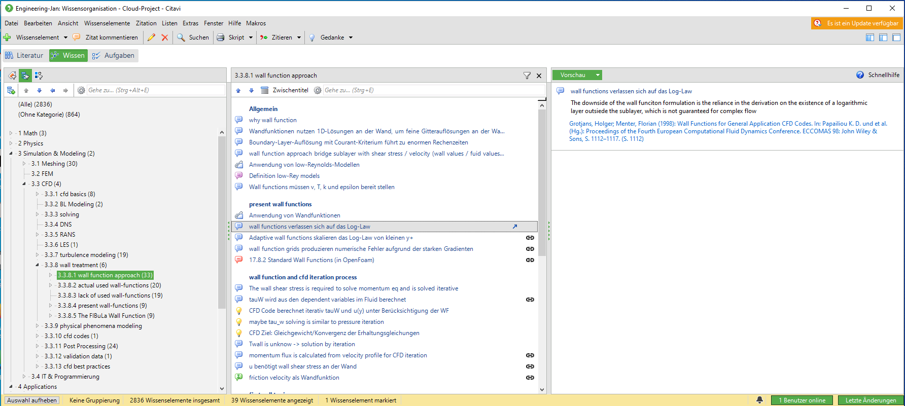

Citavi
======================================================================

Citavi ist ein Programm zur Literaturverwaltung mit einer integrierten Wissensdatenbank. 

## Nachteile 
* Proprietäre Software: Nutzung als Angestellter in Firmen nicht erlaubt
* Viel Klickerei ist selbsterklärend aber zu langsam für kleine Notizen
* Keine native Linux Umgebung 
* In Web-Oberfläche für die Cloud auf 5 GB beschränkt 
* Schlechte Integration von kleinen atomaren Notizen ohne Literaturstelle

My History
------------------------------------------------------------

* seit 2012 Citavi 
    * Literaturrecherche für meine Diss
    * Sortierung von Wissenselementen als Grundstruktur für meine Diss
* Ab 2017 nur als VM unter Linux
* Seit 2018 nur noch als Nachschlagewerk und nicht mehr aktiv gepflegt. 

Literature Work
------------------------------------------------------------
The strong suit of Citavi is the work around literature resources. 

Normally you go into a resource, mark text passages and write stuff down as literature excerpts.  
  

Afterwards you categorize these excerpts and build a basis for your thesis: 
  

In the writing process you only have to take these blocks/excerpts from Citavi and write the floating text around these key statements. 
And finally you find the excerpts and references in your work: 

For example in my Diss ([Lehmkuhl2018](/engineering/computational-fluid-dynamics/wall-functions/_resources/Lehmkuhl2018_Dissertation_modeling-a-numeric-wall-function.md#505081))  
  

RESOURCES
======================================================================

[citavi.com](https://www.citavi.com/en)  
